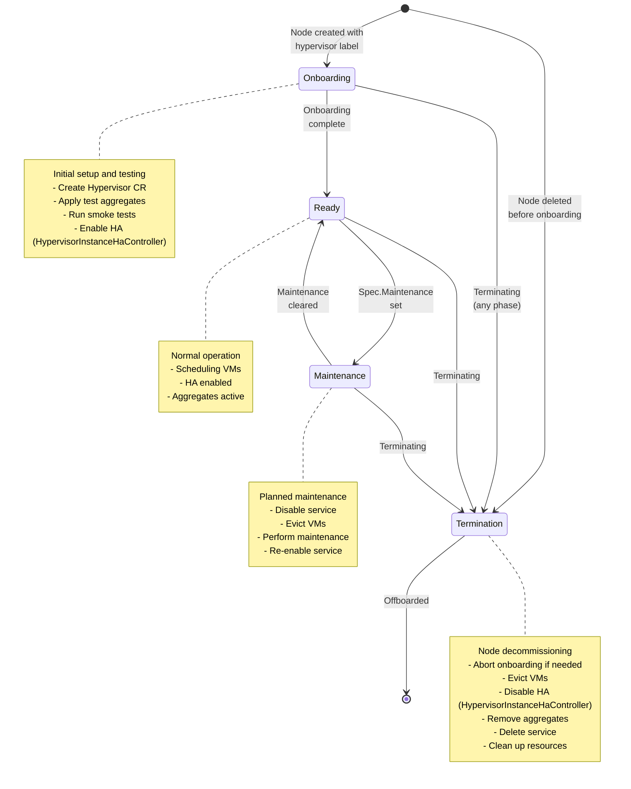
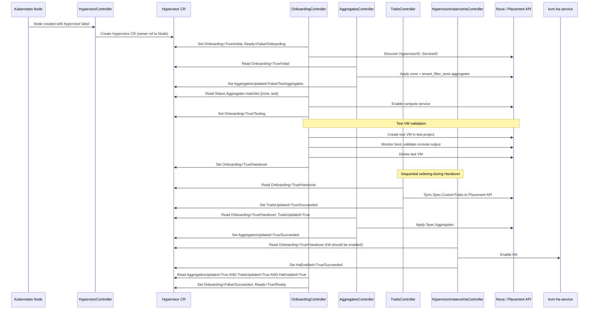
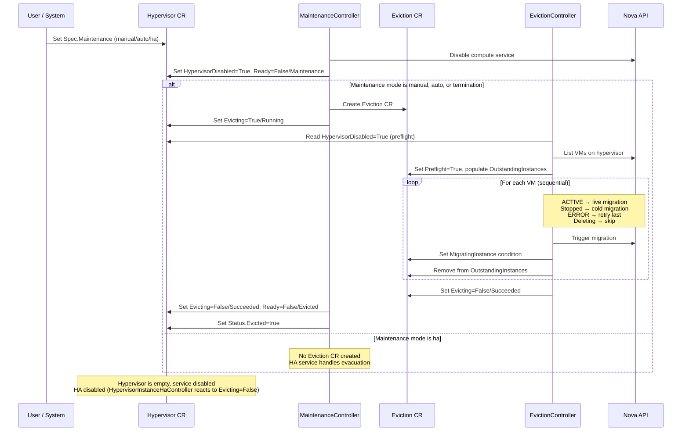
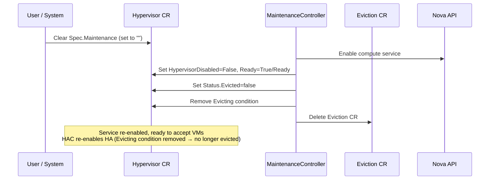
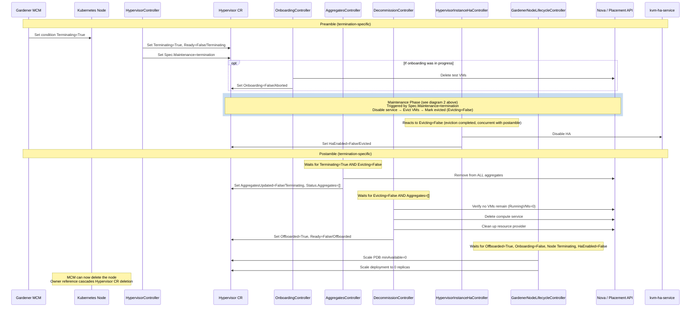

<!--
# SPDX-FileCopyrightText: Copyright 2026 SAP SE or an SAP affiliate company and cobaltcore-dev contributors
#
# SPDX-License-Identifier: Apache-2.0
-->

# OpenStack Hypervisor Operator - Controllers

This document describes how the controllers in the OpenStack Hypervisor Operator interact through conditions on the Hypervisor resource.

## Overview

The operator manages the lifecycle of OpenStack compute hypervisors through multiple controllers that coordinate via Kubernetes conditions on the `Hypervisor` custom resource.

## Controllers

- **HypervisorController** (`hypervisor_controller.go`)
   - Creates Hypervisor CR from Kubernetes Node (with owner reference)
   - On creation sets defaults: `HighAvailability=true`, `InstallCertificate=true`
   - Syncs Node → Hypervisor CR (all one-directional):
     - **Labels:**
       - `kubernetes.io/hostname`,
       - `topology.kubernetes.io/region`
       - `topology.kubernetes.io/zone`
       - `kubernetes.metal.cloud.sap/{bb,cluster,name,type}`
       - `worker.garden.sapcloud.io/group`
       - `worker.gardener.cloud/pool`
       - (plus any keys from global LabelSelector)
     - **Annotations → Spec:**
       - `nova.openstack.cloud.sap/aggregates` → `Spec.Aggregates` (comma-split, zone appended)
       - `nova.openstack.cloud.sap/custom-traits` → `Spec.CustomTraits` (comma-split)
     - **Label → Spec:**
       - `cobaltcore.cloud.sap/node-hypervisor-lifecycle` presence → `Spec.LifecycleEnabled=true`, value `"skip-tests"` → `Spec.SkipTests=true`
     - **Status:** Node internal IP → `Status.InternalIP`
   - Propagates Node `Terminating=True` condition → sets `Terminating` and `Ready=False` on Hypervisor CR

- **OnboardingController** (`onboarding_controller.go`)
   - Manages initial hypervisor onboarding
   - Runs smoke tests to verify hypervisor functionality
   - Coordinates with AggregatesController and TraitsController for completion
   - Waits for `HaEnabled=True` (set by HypervisorInstanceHaController) before completing onboarding

- **AggregatesController** (`aggregates_controller.go`)
   - Manages OpenStack aggregate membership
   - Applies different aggregates based on lifecycle phase
   - Coordinates with onboarding and termination flows
   - `Spec.Aggregates` defines the desired state.
   - `Status.Aggregates` contains the last configured aggregates as with their name and uuid.

- **HypervisorMaintenanceController** (`hypervisor_maintenance_controller.go`)
   - Manages the compute service state and VM evacuation during maintenance
   - Reacts to `Spec.Maintenance`:
     - `""` (unset): Re-enables the OpenStack compute service, deletes any Eviction CR, and restores `Ready=True`
     - `"manual"` / `"auto"` / `"termination"`: Disables compute service and creates an Eviction CR to migrate VMs off the hypervisor. The three modes behave identically in this controller; they differ only in origin (`manual` = external user, `auto` = automated maintenance, `termination` = node terminating)
     - `"ha"`: Disables compute service but does **not** create an Eviction CR (the HA service handles evacuation)

- **EvictionController** (`eviction_controller.go`)
   - Executes VM migration off the hypervisor by reconciling on `Eviciton` CRDs
   - Manages live and cold migration of instances

- **DecommissionController** (`decomission_controller.go`)
   - Handles hypervisor offboarding
   - Cleans up OpenStack service and resource provider
   - Runs during node termination

- **GardenerNodeLifecycleController** (`gardener_node_lifecycle_controller.go`)
   - Signals node state to Gardener Machine Controller Manager
   - Creates blocking PodDisruptionBudgets
   - Manages readiness signaling deployment
   - Waits for `HaEnabled=False` (set by HypervisorInstanceHaController) before allowing node deletion during offboarding

- **HypervisorInstanceHaController** (`hypervisor_instance_ha_controller.go`)
   - Enables or disables instance HA on `kvm-ha-service` in response to spec and lifecycle changes
   - Reads `Spec.HighAvailability`, the `Onboarding` condition, and the `Evicting` condition:
   - **Enables HA** (`HaEnabled=True`) when `Spec.HighAvailability=true`, onboarding has reached Handover or Succeeded, and no eviction has completed
   - **Disables HA** (`HaEnabled=False`) when any of:
     - `Spec.HighAvailability=false` (reason: `Succeeded` — "HA disabled per spec")
     - `Evicting=False` (eviction completed, hypervisor is empty; reason: `Evicted`)
     - Onboarding is still in Initial/Testing phase or was Aborted (reason: `Onboarding`)
   - Sets `HaEnabled=Unknown/Failed` if the `kvm-ha-service` request fails
   - Skips the `kvm-ha-service` request if the condition already reflects the desired state (idempotent)
   - Does nothing if the `Onboarding` condition has never been set

- **TraitsController** (`traits_controller.go`)
   - Syncs `Spec.CustomTraits` to the OpenStack Placement API
   - Operates after onboarding completes (`Onboarding=False`) and also during the Handover phase (`Onboarding=True/Handover`)
   - Does NOT run during Initial or Testing phases, or when node is terminating
   - Sets `TraitsUpdated` condition

- **HypervisorTaintController** (`hypervisor_taint_controller.go`)
    - Detects if the Hypervisor CR was edited via `kubectl`
    - Sets `Tainted` condition as a warning signal

- **NodeCertificateController** (`node_certificate_controller.go`)
    - Creates cert-manager `Certificate` CRs for libvirt TLS
    - Generates RSA 4096-bit certificates covering all node IPs/DNS names

## Spec Fields

Spec fields are the primary inputs for controllers:

| Field | Type | Read By | Description |
|-------|------|---------|-------------|
| `Spec.LifecycleEnabled` | bool | OnboardingController | Gates onboarding and termination. When `false`, onboarding is aborted and the hypervisor is left unmanaged. |
| `Spec.SkipTests` | bool | OnboardingController | Skips smoke tests during onboarding. Set from the `cobaltcore.cloud.sap/node-hypervisor-lifecycle=skip-tests` node label. |
| `Spec.Maintenance` | string | HypervisorMaintenanceController | Triggers maintenance mode. Values: `""` (none), `manual`, `auto`, `ha`, `termination`. |
| `Spec.HighAvailability` | bool | HypervisorInstanceHaController | Enables or disables instance HA on `kvm-ha-service`. |
| `Spec.Aggregates` | []string | AggregatesController | OpenStack aggregates to apply once onboarding reaches the Handover phase. Set from the `nova.openstack.cloud.sap/aggregates` node annotation. |
| `Spec.CustomTraits` | []string | TraitsController | Placement API traits to sync. Set from the `nova.openstack.cloud.sap/custom-traits` node annotation. |

## Conditions

Conditions are used to track state and coordinate between controllers:

| Condition | Description | Set By | Required for `Ready=True` |
|-----------|-------------|--------|---------------------------|
| `Ready` | Overall readiness of the hypervisor | HypervisorController, OnboardingController, HypervisorMaintenanceController, DecommissionController | *(this is the readiness condition itself)* |
| `Onboarding` | Onboarding process state | OnboardingController | `False` (reason: Succeeded) — while `True`, Ready is held at False (reason: Onboarding) |
| `Terminating` | Node is being terminated | HypervisorController | Absent or `False` — when `True`, sets Ready=False (only if Ready was still True, to avoid overwriting other controllers) |
| `HypervisorDisabled` | OpenStack compute service disabled | HypervisorMaintenanceController | `False` — when `True`, Ready=False (reason: Maintenance) |
| `Evicting` | VMs are being migrated off | HypervisorMaintenanceController (on Hypervisor), EvictionController (on Eviction CR) | Absent — when present with reason Running: Ready=False (reason: Evicting); when reason Succeeded: Ready=False (reason: Evicted) |
| `Offboarded` | Cleanup completed | DecommissionController | Absent — when `True`, Ready=False (reason: Offboarded); this is a terminal state |
| `AggregatesUpdated` | OpenStack aggregates synced | AggregatesController | `True` — required for onboarding to complete (which sets Ready=True); not directly re-checked at runtime |
| `TraitsUpdated` | Placement API traits synced | TraitsController | `True` — required for onboarding to complete (which sets Ready=True); not directly re-checked at runtime |
| `HaEnabled` | Instance HA enabled/disabled state | HypervisorInstanceHaController | `True` — required for onboarding to complete when `Spec.HighAvailability=true`; `False` required before GardenerNodeLifecycleController allows node deletion during offboarding |

## State Diagrams

### High-Level Overview

This diagram shows the phases a hypervisor goes through during its lifecycle:



### Detailed Phase Diagrams

#### 1. Onboarding Phase



#### 2. Maintenance Phase



#### 2b. Maintenance Recovery (Return to Ready)



#### 3. Termination Phase



## Detailed Flow Descriptions

### 0. Hypervisor CR Creation (New Node -> Hypervisor CR)

**HypervisorController** detects a new Node with the hypervisor label and creates a Hypervisor CR with:

- Owner reference to the Node
- Hardcoded defaults: `HighAvailability=true`, `InstallCertificate=true`
- Synced from Node labels/annotations (see HypervisorController description above for full list):
  - `LifecycleEnabled` and `SkipTests` from `cobaltcore.cloud.sap/node-hypervisor-lifecycle` label
  - `Spec.Aggregates` from `nova.openstack.cloud.sap/aggregates` annotation (+ zone)
  - `Spec.CustomTraits` from `nova.openstack.cloud.sap/custom-traits` annotation

### 1. Onboarding Flow (Hypervisor CR -> Ready)

**Preconditions:**
- `Spec.LifecycleEnabled` is `true`
- `Terminating` condition is not `True`

**Steps:**

1. **OnboardingController** starts Initial phase
   - Sets `Ready=False/Onboarding`, `Onboarding=True/Initial`
   - Discovers `HypervisorID` and `ServiceID` from Nova

2. **AggregatesController** applies test aggregates
   - Once `Onboarding=True/Initial`:
     - Adds hypervisor to zone aggregate + test aggregate (`tenant_filter_tests`)
     - Sets `AggregatesUpdated=False/TestAggregates`

3. **OnboardingController** enters Testing phase
   - Once `Status.Aggregates` matches `[zone, tenant_filter_tests]`:
     - Enables Nova compute service
     - Sets `Onboarding=True/Testing`
   - Creates test VM in test project on this specific hypervisor
   - Monitors VM creation and boot
   - Validates console output contains server name
   - Deletes test VM upon success

4. **OnboardingController** enters Handover phase
   - Deletes remaining test VMs
   - Sets `Onboarding=True/Handover`

5. **TraitsController** syncs custom traits
   - Once `Onboarding=True/Handover` (or `Onboarding=False`):
     - Syncs `Spec.CustomTraits` to OpenStack Placement API
     - Sets `TraitsUpdated=True/Succeeded`

6. **AggregatesController** applies production aggregates (sequential after traits)
   - Once `Onboarding=True/Handover`:
     - If `TraitsUpdated` is not `True`: keeps test aggregates, sets `AggregatesUpdated=False/WaitingForTraits`
     - Once `TraitsUpdated=True`: applies aggregates from `Spec.Aggregates`, sets `AggregatesUpdated=True/Succeeded`

6b. **HypervisorInstanceHaController** enables HA
   - Once `Onboarding=True/Handover` (and `Spec.HighAvailability=true`):
     - Enables HA on `kvm-ha-service`
     - Sets `HaEnabled=True/Succeeded`
   - Runs concurrently with steps 5 and 6 — all three can complete in any order

7. **OnboardingController** completes onboarding
   - Once `AggregatesUpdated=True` AND `TraitsUpdated=True` AND (if `Spec.HighAvailability=true`) `HaEnabled=True`:
     - Sets `Onboarding=False/Succeeded`, `Ready=True/Ready`

8. **GardenerNodeLifecycleController** signals readiness
   - Once `Onboarding=False`:
      - Marks the deployment as ready (pod becomes schedulable)
      - Gardener MCM detects node is ready

### 2. Maintenance Flow (Ready -> Maintenance -> Ready)

**Preconditions:**
- `Onboarding` condition is not `True` (absent or `False`)

**Steps:**

1. **User/System** sets `Spec.Maintenance` (manual, auto, or ha)

2. **HypervisorMaintenanceController** disables compute service
   - Disables compute service via OpenStack API (prevents new VM scheduling)
   - Sets `HypervisorDisabled=True/Succeeded`, `Ready=False/Maintenance`

3. **HypervisorMaintenanceController** creates Eviction CR
   - Only for modes `manual`, `auto`, or `termination` (not `ha` — HA eviction is handled externally)
   - Creates Eviction custom resource with `Spec.Hypervisor` set
   - Sets `Evicting=True/Running` on Hypervisor

4. **EvictionController** runs preflight checks
   - After `HypervisorDisabled=True` on Hypervisor:
     - Queries OpenStack for the list of VMs on the hypervisor
     - Populates `Status.OutstandingInstances` array
     - Sets `Preflight=True/Succeeded` on Eviction CR

5. **EvictionController** migrates VMs sequentially
   - For each VM in `OutstandingInstances` (processes last element):
     - ACTIVE: triggers live migration
     - Stopped: triggers cold migration
     - ERROR: moves to front of array (tried last), returns error
     - MIGRATING/RESIZE: waits and polls (10s)
     - task_state=deleting: moves to front (skip for now)
     - Already on different host: removes from list
   - Updates `MigratingInstance` condition on Eviction CR
   - Removes from list when migration completes

6. **EvictionController** completes eviction
   - Once `OutstandingInstances` is empty:
     - Sets `Evicting=False/Succeeded` on Eviction CR

7. **HypervisorMaintenanceController** marks hypervisor as evicted
   - Once Eviction CR has `Evicting=False`:
     - Sets `Evicting=False/Succeeded`, `Ready=False/Evicted` on Hypervisor
     - Sets `Status.Evicted=true`

8. **User/System** clears `Spec.Maintenance` after maintenance
   - Sets `Spec.Maintenance=""` or removes field

9. **HypervisorMaintenanceController** re-enables service
   - Once `Spec.Maintenance=""`:
     - Enables compute service via OpenStack API
     - Sets `HypervisorDisabled=False/Succeeded`, `Ready=True/Ready`
     - Sets `Status.Evicted=false`
     - Removes `Evicting` condition and deletes Eviction CR

**Note:** Instance HA is disabled during `manual`/`auto`/`termination` maintenance once eviction completes and `Evicting=False` is set. After maintenance recovery (service re-enabled, `Evicting` condition removed), `HypervisorInstanceHaController` re-enables HA. For `ha` maintenance mode (no Eviction CR created), the `Evicting` condition is never set to `False`, so HA is not disabled by the controller — the HA service handles evacuation directly.

### 3. Termination Flow (Ready -> Offboarded)

Termination is a special case of the [Maintenance Flow](#2-maintenance-flow-ready---maintenance---ready): the same eviction core (steps 2-7) runs, preceded by termination-specific setup and followed by cleanup steps that replace the normal recovery (steps 8-9).

**Preconditions:**
- `Spec.LifecycleEnabled` is `true`
- Node has `Terminating=True` condition (set by Gardener MCM)

**Steps:**

1. **HypervisorController** propagates termination
   - Sets `Terminating=True`, `Ready=False/Terminating` on Hypervisor (only if Ready is currently True or nil)
   - Sets `Spec.Maintenance=termination`

2. **OnboardingController** aborts if onboarding was in progress
   - Deletes any test VMs
   - Sets `Onboarding=False/Aborted`, `Ready=False/Onboarding` (only if Ready was set by onboarding)

3. **Maintenance Flow steps 2-7** — eviction core
   - `Spec.Maintenance=termination` triggers the same sequence as any other maintenance mode: disable compute service, create Eviction CR, migrate VMs, mark evicted
   - See [Maintenance Flow](#2-maintenance-flow-ready---maintenance---ready) for full details
   - After eviction completes, the flow continues below instead of waiting for a user to clear `Spec.Maintenance` (steps 8-9 of Maintenance do not apply)

4. **AggregatesController** removes from aggregates
   - Once `Terminating=True` AND `Evicting=False`:
     - Removes hypervisor from ALL OpenStack aggregates
     - Sets `AggregatesUpdated=False/Terminating`, `Status.Aggregates=[]`
   - Must wait for eviction to complete — removing aggregates during migration could cause scheduling failures

5. **DecommissionController** deletes OpenStack resources
   - Once `Evicting=False` (if `ServiceID` is set) AND `Status.Aggregates=[]`:
     - Queries OpenStack to verify no VMs remain
     - Deletes OpenStack compute service
     - Cleans up placement resource provider
     - Sets `Offboarded=True/Offboarded`, `Ready=False/Offboarded`

6. **HypervisorInstanceHaController** disables HA
   - Reacts to `Evicting=False` (set by HypervisorMaintenanceController when eviction completes, during step 3)
   - Runs concurrently with steps 4 and 5 (AggregatesController and DecommissionController also wait for `Evicting=False`)
   - Disables HA on `kvm-ha-service`
   - Sets `HaEnabled=False/Evicted`

7. **GardenerNodeLifecycleController** allows node deletion
   - Once `Offboarded=True` AND `Onboarding=False` AND `HaEnabled=False` (when Node is Terminating):
     - Scales PodDisruptionBudget `minAvailable=0`
     - Scales deployment to 0 replicas
     - Gardener MCM can now delete the node

8. **Node deletion** cascades to Hypervisor CR deletion via owner reference

### 4. Abort Onboarding Flow

**Causes:**

- **Lifecycle disabled** — `Spec.LifecycleEnabled` set to `false`
- **Node terminating** — Node gets `Terminating=True` condition

**Behavior:** OnboardingController detects either condition during any onboarding phase and:

- Deletes test VMs from test project
- Sets `Onboarding=False/Aborted`
- Sets `Ready=False/Onboarding` (message: "Aborted") if Ready was set by onboarding controller

**Aftermath:**

- **If lifecycle disabled:** Hypervisor remains in the cluster but unmanaged. AggregatesController leaves current aggregates in place.
- **If terminating:** Proceeds to Termination Flow (see section 3). AggregatesController will handle aggregate removal as part of that flow.

## Controller Coordination

1. **Onboarding Completion** (Traits → Aggregates → HA enable → Complete)
   - During Handover phase, TraitsController syncs custom traits first (`TraitsUpdated=True`)
   - AggregatesController waits for `TraitsUpdated=True` before applying spec aggregates (`AggregatesUpdated=True`)
   - HypervisorInstanceHaController enables HA and sets `HaEnabled=True` (runs concurrently with Traits/Aggregates)
   - OnboardingController waits for all three: `AggregatesUpdated=True` AND `TraitsUpdated=True` AND (if `Spec.HighAvailability=true`) `HaEnabled=True`
   - Only then sets: `Onboarding=False/Succeeded`, `Ready=True/Ready`

2. **Eviction Start**
   - EvictionController waits for: `HypervisorDisabled=True` (on Hypervisor)
   - Validates hypervisor is disabled before migrating VMs

3. **Aggregate Removal During Termination**
   - AggregatesController waits for: `Terminating=True` AND `Evicting=False` (on Hypervisor)
   - Ensures VMs are migrated before removing aggregate membership

4. **Service Deletion**
   - DecommissionController waits for: `Evicting=False` AND `Status.Aggregates=[]`
   - Ensures hypervisor is evacuated and isolated before deletion

5. **HA Disable Before Gardener Node Lifecycle**
   - HypervisorInstanceHaController disables HA when `Evicting=False` (eviction completed), sets `HaEnabled=False/Evicted`
   - GardenerNodeLifecycleController allows termination when:
     - `Offboarded=True`
   - When additionally `Onboarding=False` AND Node has `Terminating` condition: waits for `HaEnabled=False` before scaling down PDB/deployment
   - Blocks termination during onboarding or operation via PDB with `minAvailable=1`

## Aggregate Management Strategy

The AggregatesController applies different aggregate sets based on lifecycle phase:

| Phase | Aggregates Applied | Condition Status |
|-------|-------------------|------------------|
| Onboarding (Initial/Testing) | zone + `tenant_filter_tests` | `AggregatesUpdated=False/TestAggregates` |
| Onboarding (Handover, traits pending) | zone + `tenant_filter_tests` (unchanged) | `AggregatesUpdated=False/WaitingForTraits` |
| Onboarding (Handover, traits ready) | `Spec.Aggregates` | `AggregatesUpdated=True/Succeeded` |
| Normal Operation | `Spec.Aggregates` | `AggregatesUpdated=True/Succeeded` |
| Terminating (before eviction) | Current aggregates unchanged | `AggregatesUpdated=False/EvictionInProgress` |
| Terminating (after eviction) | Empty (removed from all) | `AggregatesUpdated=False/Terminating` |

- Test aggregate during onboarding isolates test VMs from production traffic
- Production aggregates are applied only after testing succeeds
- Aggregates are retained during eviction to ensure VM placement remains valid
- Aggregates are removed after eviction to prevent scheduling on the decommissioned hypervisor

## HA Management

Instance HA is managed by `HypervisorInstanceHaController`, which manages the `HaEnabled` condition and all requests to `kvm-ha-service`.

| Desired State | Trigger | Action | Condition Set |
|---------------|---------|--------|---------------|
| Enable HA | `Onboarding=True/Handover` (or `Onboarding=False/Succeeded`) with `Spec.HighAvailability=true`, `Evicting` not False | Enables HA on `kvm-ha-service` | `HaEnabled=True/Succeeded` |
| Disable HA (evicted) | `Evicting=False` (eviction completed) | Disables HA on `kvm-ha-service` | `HaEnabled=False/Evicted` |
| Disable HA (spec) | `Spec.HighAvailability=false` | Disables HA on `kvm-ha-service` | `HaEnabled=False/Succeeded` |
| Disable HA (onboarding) | `Onboarding=True` with reason not `Handover`, or `Onboarding=False/Aborted` | Disables HA on `kvm-ha-service` | `HaEnabled=False/Onboarding` |

**Key behaviors:**
- HA is enabled during the Handover phase, after `Onboarding=True/Handover` is set
- The kvm-ha-service request is skipped if the condition already reflects the desired state (idempotent)
- HA is disabled during `manual`/`auto`/`termination` maintenance once eviction completes (`Evicting=False`), and re-enabled after recovery when the `Evicting` condition is removed
- For `ha` maintenance mode, no `Evicting=False` condition is set, so the controller does not disable HA
- A missing hypervisor record in `kvm-ha-service` is treated as already-disabled
- The controller does nothing if the `Onboarding` condition has never been set

## Error Handling

### Onboarding Failures

- **Test VM fails:** OnboardingController deletes failed VM, updates condition message, requeues after 1 minute
- **Service not found:** Requeues after 1 minute, waits for OpenStack registration
- **Aggregate sync fails:** AggregatesController sets `AggregatesUpdated=False/Failed`, returns error for retry

### Eviction Failures

- **VM migration ERROR state:** Moves VM to front of array (tried last), sets `MigratingInstance=False/Failed`, returns error
- **Migration API failure:** EvictionController sets `MigratingInstance=False/Failed`, returns error for retry
- **Deleting VM:** Moves to front of array (skip for now), sets `MigratingInstance=False/Failed`
- **Hypervisor not found in Nova:** If expected, sets `Evicting=False/Failed`; if not expected (no IDs), sets `Evicting=False/Succeeded`

### Termination Failures

- **VMs still present:** DecommissionController sets `Ready=False/Decommissioning` with message, requeues
- **Service deletion fails:** Reports error, retries
- **Aggregates not cleared:** Blocks decommission, sets `Ready=False/Decommissioning` with message

## Testing the Flows

### Test Onboarding

```bash
# Watch hypervisor progress
kubectl get hypervisor <node-name> -w

# Check detailed conditions
kubectl get hypervisor <node-name> -o jsonpath='{.status.conditions}' | jq

# Expected condition progression:
# 1. Onboarding=True/Initial
# 2. Onboarding=True/Testing
# 3. Onboarding=True/Handover
# 4. Onboarding=False/Succeeded, Ready=True
```

### Test Maintenance

```bash
# Enter maintenance
kubectl patch hypervisor <node-name> --type=merge -p '{"spec":{"maintenance":"manual","maintenanceReason":"OS update"}}'

# Watch eviction progress
kubectl get eviction <node-name> -w
kubectl get eviction <node-name> -o jsonpath='{.status.outstandingInstances}'

# Exit maintenance
kubectl patch hypervisor <node-name> --type=merge -p '{"spec":{"maintenance":""}}'
```

### Test Termination

```bash
# Mark node for termination (depends on MCM)
kubectl annotate node <node-name>  node.machine.sapcloud.io/trigger-deletion-by-mcm=true'

# Watch progression
kubectl get hypervisor <node-name> -o jsonpath='{.status.conditions}' | jq -r '.[] | "\(.type)=\(.status)/\(.reason)"'

# Expected: Terminating=True -> Evicting=False -> Offboarded=True
```
